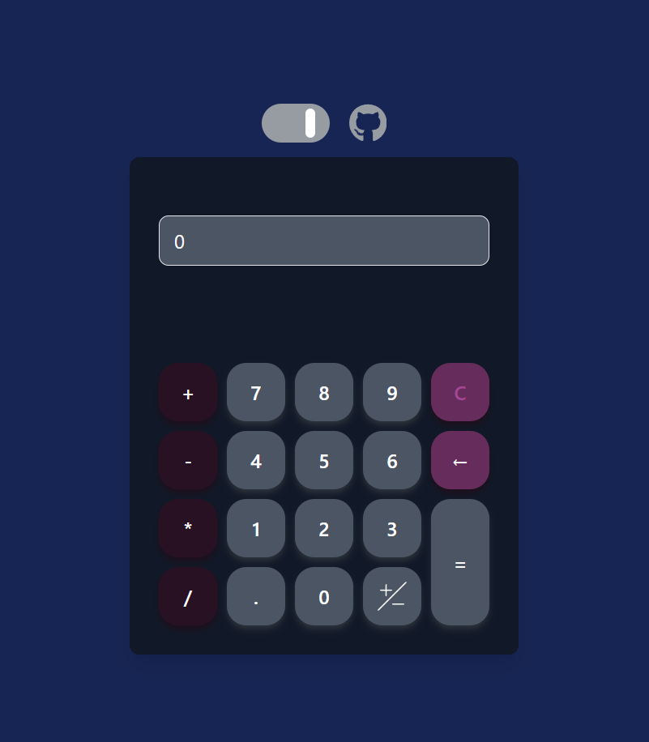
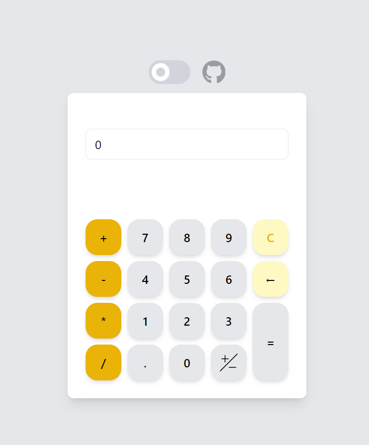

# Basic Tailwind Calculator

This is a very simple calculator designed with Tailwind CSS. It includes the basic operations with decimal and has a toggleable dark mode.

## Requirements

1. Node.js
2. Express
3. Tailwind CSS
4. SQLite

## Installation

1. Download project or clone by using:

```bash
git clone https://github.com/Ibraboss13/tailwind-calculator.git
```
2. Start with IDE or Code Editor.
3. Open terminal and type:
```bash
npm run start
```
4. Open 
`http://localhost:3000/`

## Screenshots



